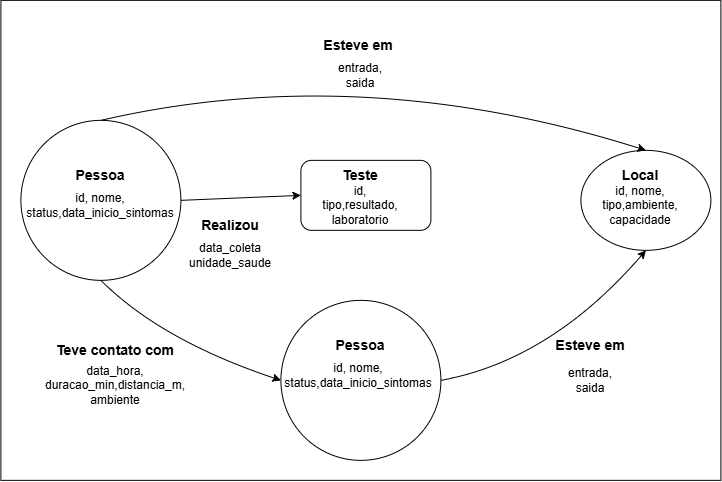

# O Mundo em Grafos e o Paradoxo Relacional

## Grupo 5 – Mapeamento de Epidemiologia e Contágio (Contact Tracing)

Alunos: Deivid Galindo e Guilherme Henrique Silva

## O Problema de Negócio

Imagine que a nossa equipe trabalha no setor de vigilância epidemiológica de uma secretaria de saúde. Surgiu um vírus novo na cidade e a missão é descobrir **quem foi o "Paciente Zero"** e **quem pode ter sido infectado depois dele**, para isolar essas pessoas rápido.

Para isso, a gente precisa cruzar três tipos de informação:

- **Pessoas** (quem são, se estão saudáveis, suspeitas ou confirmadas, e quando começaram os sintomas);
- **Contatos entre pessoas** (quem encontrou quem, quando, por quanto tempo e a que distância);
- **Locais visitados** (mercado, escola, ônibus, academia… e o horário de entrada e saída).

E aqui tem um detalhe importante: o Ministério da Saúde define como **contato próximo** quem ficou **a menos de 1 metro de um caso confirmado por pelo menos 15 minutos**, num período que vai de 2 dias antes até 10 dias depois do início dos sintomas (BRASIL, 2020). Ou seja, o dado que importa não é a pessoa isolada, é a **ligação** entre ela e as outras — e as propriedades dessa ligação (tempo e distância).

O desafio é que essa rede cresce muito rápido. Se cada pessoa teve contato com 20 outras, em 3 "saltos" já são 20 × 20 × 20 = **8.000 pessoas** para investigar. E a resposta precisa sair rápido, porque o rastreamento só funciona se os contatos forem achados nas primeiras 48 horas (BRASIL, 2020; MANAUS, 2021). Na pandemia de COVID-19, especialistas reforçaram justamente isso: testar, rastrear e isolar era o caminho para frear a transmissão (ZIEGLER, 2020).

## O Paradoxo Relacional

Num banco relacional (SQL), esse cenário viraria algo assim:

| Tabela | O que guarda |
|---|---|
| `pessoa` | id, nome, status, data_inicio_sintomas |
| `local` | id, nome, tipo, ambiente, capacidade |
| `teste` | id, tipo, resultado, laboratorio |
| `contato` | pessoa_a_id, pessoa_b_id, data_hora, duracao_min, distancia_m |
| `visita` | pessoa_id, local_id, entrada, saida |

O problema aparece em dois pontos:

**a) Self-Join (a tabela se cruzando com ela mesma).** A tabela `contato` liga `pessoa` com `pessoa`. Para achar "os contatos dos contatos dos contatos", eu preciso fazer um JOIN da tabela com ela mesma para **cada nível**:

```sql
-- Contatos até o 3º nível da pessoa 1 (já fica feio)
SELECT DISTINCT c3.pessoa_b_id
FROM contato c1
JOIN contato c2 ON c2.pessoa_a_id = c1.pessoa_b_id
JOIN contato c3 ON c3.pessoa_a_id = c2.pessoa_b_id
WHERE c1.pessoa_a_id = 1;
```

E no caso do Paciente Zero a gente **não sabe quantos níveis existem**. Daí tem que partir para consulta recursiva (`WITH RECURSIVE`), que a cada volta gera mais linhas intermediárias. É a tal **explosão combinatória**.

**b) Tabelas N:M gigantes.** `contato` e `visita` são tabelas associativas (muitos-para-muitos), que é a forma padrão de representar relacionamentos N:M no modelo relacional (ELMASRI; NAVATHE, 2018). Numa cidade com milhões de pessoas, elas ficam com centenas de milhões de linhas. Cada JOIN precisa procurar no índice qual linha casa com qual, e o custo vai somando a cada nível de profundidade.

Resumindo: no SQL o relacionamento **não existe de verdade**, ele é "calculado" na hora da consulta pelos JOINs (ALURA, 2025). Quanto mais fundo a gente vai na rede, mais caro fica.

Já no banco de grafos, cada nó guarda o "endereço" direto dos seus vizinhos. Isso se chama **adjacência livre de índice** (*index-free adjacency*): andar de uma pessoa para outra é só seguir o ponteiro, sem buscar em tabela nenhuma. Num estudo do IME-USP comparando Neo4j e PostgreSQL, o banco de grafos foi cerca de **uma ordem de grandeza mais rápido** em consultas de caminho, e a vantagem aumentava conforme a profundidade crescia (HIGA, 2016).

> **Observação:** Um estudo da ERBD mostrou o MySQL indo melhor que o Neo4j em cargas simples, como filtros e carga de dados (HOMRICH; MERGEN, 2018). Por isso a proposta é usar grafo **onde o relacionamento é o centro do problema** — que é exatamente o caso do rastreamento de contágio.

## O Modelo de Grafo (Diagrama)




### Nós (Nodes)

| Nó | Propriedades | Por quê |
|---|---|---|
| **Pessoa** | `id`, `nome`, `status` (saudável / suspeito / confirmado), `data_inicio_sintomas` | É o centro da investigação. A data de sintomas ajuda a ordenar quem adoeceu primeiro. |
| **Local** | `id`, `nome`, `tipo` (escola, mercado…), `ambiente` (aberto/fechado), `capacidade` | Mostra pessoas que não se conhecem mas estiveram no mesmo lugar. |
| **Teste** | `id`, `tipo` (RT-PCR, antígeno), `resultado`, `laboratorio` | Confirma ou descarta o caso. |

### Arestas (Edges) – conexões direcionadas

| Aresta | De → Para | Propriedades |
|---|---|---|
| **TEVE_CONTATO_COM** | Pessoa → Pessoa | `data_hora`, `duracao_min`, `distancia_m`, `ambiente` |
| **ESTEVE_EM** | Pessoa → Local | `entrada`, `saida` |
| **REALIZOU** | Pessoa → Teste | `data_coleta`, `unidade_saude` |

As propriedades `duracao_min` e `distancia_m` foram escolhidas de propósito: com elas dá para aplicar direto a regra do Ministério da Saúde (menos de 1 m por 15 min ou mais) e filtrar só os contatos de risco.

As duas bolinhas "Pessoa" no desenho são o **mesmo tipo de nó** — aparecem duas vezes só para mostrar que uma pessoa se liga a outra pessoa (o auto-relacionamento que no SQL vira self-join).

### Como fica a consulta no grafo

Usando Cypher (linguagem do Neo4j), buscar a cadeia de contágio de qualquer tamanho fica assim:

```cypher
// Caminho de contágio (até 6 níveis) que chega na pessoa confirmada
MATCH caminho = (origem:Pessoa)-[:TEVE_CONTATO_COM*1..6]->(caso:Pessoa {id: 'P123'})
WHERE ALL(r IN relationships(caminho) WHERE r.distancia_m < 1 AND r.duracao_min >= 15)
RETURN origem.nome, origem.data_inicio_sintomas, length(caminho)
ORDER BY origem.data_inicio_sintomas ASC
LIMIT 1;
```

A pessoa com os sintomas mais antigos no início da cadeia é a principal candidata a **Paciente Zero**. E para achar quem esteve no mesmo lugar que ela:

```cypher
MATCH (p0:Pessoa {id: 'P001'})-[v1:ESTEVE_EM]->(l:Local)<-[v2:ESTEVE_EM]-(outro:Pessoa)
WHERE v1.entrada < v2.saida AND v2.entrada < v1.saida   // horários se cruzaram
RETURN l.nome, collect(outro.nome) AS expostos;
```

Repare que a gente não precisou de nenhum JOIN: a consulta só "anda" pelas setas do desenho.

## Conclusão

No rastreamento de contatos, a pergunta nunca é "quem é essa pessoa?", e sim "**com quem ela se conectou, onde e por quanto tempo?**". O modelo relacional responde isso empilhando JOINs, e fica mais lento a cada nível. O modelo em grafo guarda a conexão como dado de primeira classe, então seguir a cadeia de contágio é natural e rápido. Para um problema em que o tempo de resposta salva vidas, a mudança para grafos faz todo sentido — e nem é preciso jogar o banco antigo fora, já existem ferramentas que migram dados relacionais para grafos de forma automatizada (CONEGERO; HARA, 2025).

## Referências

ALURA. Trabalhando com relacionamentos: bancos de dados baseados em grafos e o Neo4j. São Paulo: Alura, 2025. Disponível em: https://www.alura.com.br/artigos/trabalhando-com-relacionamentos-bancos-de-dados-baseados-em-grafos-e-o-neo4j. Acesso em: 5 out. 2026.

BRASIL. Ministério da Saúde. Secretaria de Vigilância em Saúde. Guia de Vigilância Epidemiológica: Emergência de Saúde Pública de Importância Nacional pela Doença pelo Coronavírus 2019. Brasília: Ministério da Saúde, 2020. Disponível em: https://www.eel.usp.br/sites/files/eel/publico/noticia/arquivos/2020-09/guia-vigilancia-epidmiologica-ministerio-saude.pdf. Acesso em: 5 out. 2026.

CONEGERO, G. L.; HARA, C. S. Migração de bancos de dados relacionais para grafos: proposta e implementação de uma ferramenta automatizada. In: ESCOLA REGIONAL DE BANCO DE DADOS (ERBD), 20., 2025, Florianópolis. Anais [...]. Porto Alegre: Sociedade Brasileira de Computação, 2025. p. 70-79. DOI: 10.5753/erbd.2025.7370.

ELMASRI, R.; NAVATHE, S. B. Sistemas de banco de dados. 7. ed. São Paulo: Pearson Education do Brasil, 2018.

HIGA, G. T. A. Bancos de dados orientados a grafos. 2016. Trabalho de Conclusão de Curso (Bacharelado em Ciência da Computação) – Instituto de Matemática e Estatística, Universidade de São Paulo, São Paulo, 2016. Disponível em: https://linux.ime.usp.br/~taksqth/mac0499/downloads/monografia.pdf. Acesso em: 5 out. 2026.

HOMRICH, É. P.; MERGEN, S. L. S. Comparação entre MySQL e Neo4J para o acesso a dados complexos usando linguagens declarativas. In: ESCOLA REGIONAL DE BANCO DE DADOS (ERBD), 14., 2018, Rio Grande. Anais [...]. Porto Alegre: Sociedade Brasileira de Computação, 2018. Disponível em: https://sol.sbc.org.br/index.php/erbd/article/view/2827. Acesso em: 5 out. 2026.

MANAUS. Secretaria Municipal de Saúde. Plano de rastreamento, isolamento e monitoramento de contatos de casos de COVID-19 no município de Manaus. Manaus: SEMSA, 2021. Disponível em: https://www.manaus.am.gov.br/semsa/wp-content/uploads/sites/8/2023/01/Plano-de-Rastreamento-de-Contatos-SemsaManaus.pdf. Acesso em: 5 out. 2026.

ZIEGLER, M. F. Especialistas discutem rastreamento como forma de planejar ações de combate à COVID-19. Agência FAPESP, São Paulo, 8 jul. 2020. Disponível em: https://agencia.fapesp.br/especialistas-discutem-rastreamento-como-forma-de-planejar-acoes-de-combate-a-covid-19/33581. Acesso em: 5 out. 2026.
